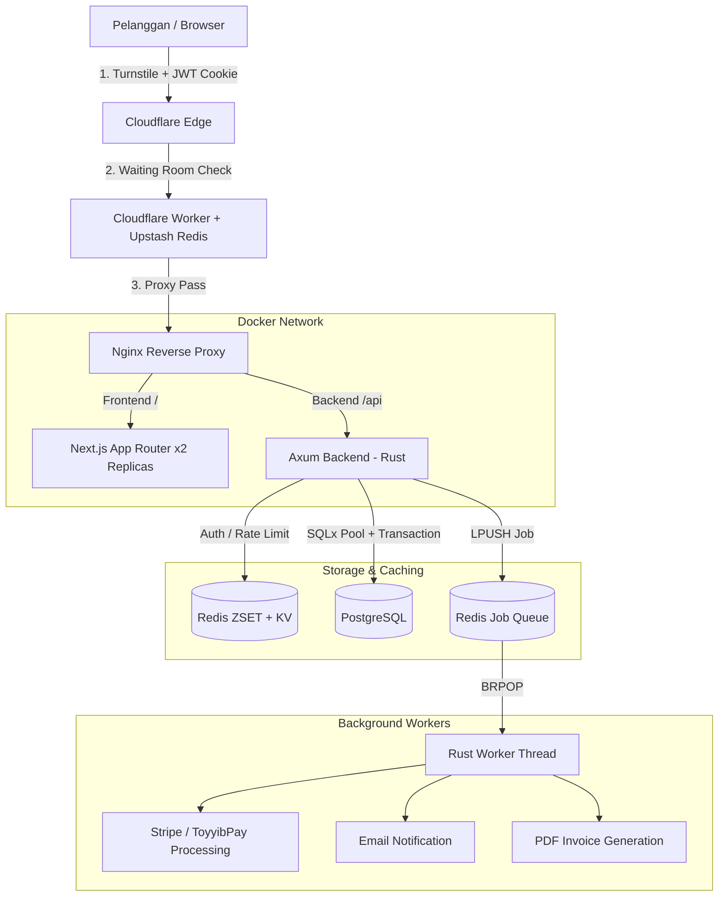

# 📋 Prompt Planning — SaaS House

_Source of Truth utama sepanjang hayat projek. Disusun mengikut piawaian Fasa 1 Abu Hanifah._

---

## 1. Visi & Misi

**Visi**: Menjadi platform agensi SaaS terurus (Managed SaaS Agency) terkemuka di Malaysia yang menyediakan pembinaan, pengehosan, dan penyelenggaraan laman web berskala tinggi untuk perniagaan SME dan Enterprise.

**Misi**: Membebaskan pemilik perniagaan daripada kerumitan teknikal — SaaS House menguruskan segala-galanya dari pembinaan hingga penyelenggaraan, supaya pelanggan hanya fokus pada perniagaan mereka.

**Proposisi Nilai (USP)**:
- Model "Website-as-a-Service" — pelanggan langgan, kami bina & urus.
- Sokongan jurutera langsung (tiada chatbot / orang tengah).
- Infrastruktur gred perusahaan (99.9% uptime, SSL, DNS automatik).
- Masa respons < 2 jam waktu bekerja.

---

## 2. Tech Stack

| Komponen | Teknologi | Catatan |
| :--- | :--- | :--- |
| **Frontend** | Next.js 15 (App Router), TypeScript, Tailwind CSS | Server Components + Client Components hibrid |
| **Backend** | Rust (Axum), SQLx | Modular handlers, JWT auth, background worker |
| **Database** | PostgreSQL | 24 migration files, UUID v4 sebagai public ID |
| **Cache & Queue** | Redis | Rate Limiting (ZSET), OTP TTL, Background Job Queue (LPUSH/BRPOP) |
| **Pembayaran** | Stripe API, ToyyibPay FPX API | Webhook via background queue untuk ketahanan |
| **Keselamatan** | Cloudflare Turnstile, Argon2 Hashing, CSRF Token | HTTP-Only Secure Cookies untuk JWT |
| **Infrastruktur** | Docker Compose, Nginx (Reverse Proxy) | 2x frontend replicas, RAM limit 4GB |
| **Edge Protection** | Cloudflare Workers + Upstash Redis | Waiting Room sliding window |
| **Real-time** | Axum WebSocket + Tokio Broadcast | One-time Redis ticket untuk WS auth |
| **CI/CD** | GitHub Actions → GHCR | Auto deploy dengan Turnstile build-args |

---

## 3. Peta Laman & Aliran Halaman (Sitemap)

### Lapisan A: Public Pages (Akses Awam)
| Laluan | Fungsi |
| :--- | :--- |
| `/` | Laman utama pemasaran & USP |
| `/showcase` | Portfolio hasil kerja agensi |
| `/showcase/[slug]` | Kajian kes projek terperinci |
| `/pricing` | Pelan harga (SME & Pro) dinamik dari DB |
| `/contact` | Borang hubungi kami (Turnstile + Rate Limit) |
| `/maintenance` | Skrin mod penyelenggaraan automatik |

### Lapisan B: Authentication & Security
| Laluan | Fungsi |
| :--- | :--- |
| `/auth/login` | Log masuk (Turnstile + Argon2 + Rate Limit) |
| `/auth/register` | Pendaftaran (Atomic Transaction: users + user_profiles) |
| `/auth/verify-2fa` | Pengesahan OTP Admin (Redis TTL 5 minit) |
| `/auth/forgot-password` | Reset kata laluan (Redis Queue → Email Worker) |
| `/auth/reset-password` | Borang tetapan kata laluan baharu |

### Lapisan C: Client Pages (Portal Pelanggan — Role: Client)
| Laluan | Fungsi |
| :--- | :--- |
| `/app/dashboard` | Ringkasan projek, bil & notifikasi |
| `/app/projects` | Senarai projek klien (OLAC: `WHERE client_id = claims.sub`) |
| `/app/projects/create` | Inisiasi projek baharu |
| `/app/projects/[id]` | Kitaran hayat projek (Draft → Review → Live) + WebSocket |
| `/app/tickets` | Senarai tiket bantuan (Bug, Fix, Feature) |
| `/app/tickets/new` | Penghantaran tiket baharu |
| `/app/tickets/[id]` | Chat interaktif real-time (WebSocket + Tokio Broadcast) |
| `/app/billing` | Ringkasan bil & status pembayaran |
| `/app/payment/success` | Halaman kejayaan pembayaran |
| `/app/payment/cancel` | Halaman pembatalan pembayaran |
| `/app/payment/toyyibpay-return` | Callback ToyyibPay FPX |
| `/app/settings/profile` | Kemas kini maklumat peribadi |
| `/app/settings/account` | Konfigurasi akaun |
| `/app/settings/security` | Pertukaran kata laluan |
| `/app/settings/notifications` | Konfigurasi makluman (Email/In-app) |

### Lapisan D: Admin Pages (Portal Pentadbir — Role: Admin + 2FA)
| Laluan | Fungsi |
| :--- | :--- |
| `/admin/dashboard` | Analitik MRR, churn, log aktiviti |
| `/admin/projects` | Pengurusan menyeluruh projek & deployment |
| `/admin/projects/[id]` | Perincian projek, rekod domain & pelayan |
| `/admin/tickets` | Pemprosesan tiket sokongan & sebut harga |
| `/admin/tickets/[id]` | Activity log tindakan admin terhadap tiket |
| `/admin/clients` | Senarai profil & projek klien |
| `/admin/users` | Pengurusan pengguna sistem |
| `/admin/billing` | Kawalan bil (Refund, Invois manual, Kegagalan) |
| `/admin/settings` | Konfigurasi sistem, templat perjanjian, harga pelan |

---

## 4. Skema Pangkalan Data (PostgreSQL)

Jadual-jadual utama berdasarkan 24 fail migrasi SQLx sedia ada:

| Jadual | Fungsi | Index Utama |
| :--- | :--- | :--- |
| `users` | Pengguna sistem (Client & Admin) | `email` (UNIQUE), `role` |
| `user_profiles` | Maklumat profil tambahan | `user_id` (FK) |
| `user_preferences` | Tetapan pilihan pengguna | `user_id` (FK) |
| `projects` | Rekod projek klien | `client_id`, `status`, `plan` |
| `requests` | Tiket bantuan / tugasan | `created_by`, `project_id` |
| `request_comments` | Perbualan dalam tiket | `request_id` |
| `ticket_attachments` | Fail lampiran tiket | `ticket_id` |
| `billing_logs` | Log transaksi kewangan | `user_id`, `status` |
| `subscriptions` | Langganan Stripe pelanggan | `user_id`, `stripe_subscription_id` |
| `webhook_logs` | Log webhook masuk (Stripe/ToyyibPay) | `provider`, `event_type` |
| `otp_codes` | Kod OTP 2FA sementara | `user_id`, `expires_at` |
| `password_resets` | Token reset kata laluan | `token` (UNIQUE), `user_id` |
| `service_agreements` | Perjanjian servis digital | `project_id`, `client_id` |
| `agreement_templates` | Templat perjanjian dinamik | `template_type` |
| `system_settings` | Konfigurasi sistem (Key-Value JSONB) | `key` (UNIQUE) |
| `security_logs` | Log aktiviti keselamatan (Audit) | `user_id`, `action` |
| `oauth_accounts` | Akaun OAuth pihak ketiga | `provider`, `provider_id` |

---

## 5. Carta Alir Teras (Core Loop — Mermaid)



---

## 6. Integrasi API & Pihak Ketiga

| Servis | Kegunaan | Endpoint Backend |
| :--- | :--- | :--- |
| **Stripe** | Pembayaran langganan automatik | `/api/webhooks/stripe` |
| **ToyyibPay** | Pembayaran FPX deposit tempatan | `/api/webhooks/toyyibpay` |
| **Cloudflare Turnstile** | Pengesahan bot pada borang sensitif | `verify_turnstile()` utility |
| **Cloudflare Workers** | Edge Waiting Room (Sliding Window) | Worker script + Upstash Redis |
| **SMTP** | Penghantaran e-mel (OTP, Reset, Notifikasi) | Background Worker Queue |
| **WebSocket** | Chat real-time (Admin ↔ Client) | `/api/ws` + `/api/ws/ticket` |

---

## 7. Protokol Keselamatan (32 Global Rules)

Projek ini mematuhi kesemua 32 Peraturan Keselamatan Global (`RULE[user_global]`). Ringkasan pelaksanaan utama:

- [x] **Input Validation**: Server-side validation pada semua endpoint Axum.
- [x] **Sanitization**: HTML escaping untuk semua data rendered di UI.
- [x] **Prepared Statements**: SQLx parameterized queries sahaja (tiada string concatenation).
- [x] **OLAC**: Setiap query `WHERE id = ? AND user_id = ?`.
- [x] **UUID v4**: Semua resource menggunakan UUID, bukan integer ID.
- [x] **Argon2 Hashing**: Kata laluan di-hash menggunakan Argon2.
- [x] **HTTP-Only Secure Cookies**: JWT disimpan dalam cookie (SameSite=Lax).
- [x] **CSRF Protection**: Token `x-csrf-token` pada setiap POST/PUT/DELETE.
- [x] **Rate Limiting (ZSET)**: Global 50/30s, Auth 5/60s.
- [x] **Cloudflare Turnstile**: Login, Register, Contact forms.
- [x] **Atomic Transactions**: SQLx Transaction untuk operasi multi-jadual.
- [x] **MIME Magic Bytes**: Validasi fail muat naik di backend.
- [x] **WS One-Time Ticket**: Redis SETEX 60s untuk WebSocket auth.
- [x] **Audit Logging**: Log keselamatan ke `security_logs` table.
- [x] **Admin 2FA**: OTP wajib untuk akses admin portal.
- [x] **Webhook Signature**: Pengesahan tandatangan Stripe webhook.

---

## 8. Struktur Folder Projek (Modular)

```
saas_house/
├── backend/
│   ├── src/
│   │   ├── main.rs              # Entry point + Axum server + auto-migration
│   │   ├── lib.rs               # Shared module exports
│   │   ├── router.rs            # Route definitions (public/client/admin)
│   │   ├── tests.rs             # Integration tests
│   │   ├── handlers/
│   │   │   ├── auth/            # Login, Register, 2FA, Forgot Password
│   │   │   ├── admin/           # Admin-specific handlers
│   │   │   ├── project.rs       # CRUD projek
│   │   │   ├── request_handler.rs  # Tiket / permintaan
│   │   │   ├── comment_handler.rs  # Chat comments (WebSocket)
│   │   │   ├── billing.rs       # Billing & subscription
│   │   │   ├── webhooks.rs      # Stripe webhook processor
│   │   │   ├── toyyibpay.rs     # ToyyibPay integration
│   │   │   ├── agreement.rs     # Service agreement
│   │   │   ├── profile.rs       # User profile
│   │   │   ├── settings.rs      # System settings
│   │   │   ├── assets.rs        # File upload/download
│   │   │   ├── tools.rs         # Domain search & utilities
│   │   │   └── *_tests.rs       # Unit tests per handler
│   │   ├── models/              # SQLx data models
│   │   │   ├── user.rs, auth.rs, project.rs, requests.rs
│   │   │   ├── billing.rs, agreement.rs, admin.rs
│   │   │   └── mod.rs
│   │   └── utils/               # Shared utilities
│   ├── migrations/              # 24 SQLx migration files
│   └── Cargo.toml
├── frontend/
│   └── src/
│       └── app/
│           ├── (public)/        # Route group: Landing, Showcase, Pricing, Contact
│           ├── (client)/        # Route group: Client portal (/app/*)
│           ├── (admin)/         # Route group: Admin portal (/admin/*)
│           ├── auth/            # Login, Register, 2FA, Reset Password
│           ├── maintenance/     # Maintenance mode page
│           ├── api/             # Next.js API routes (proxy)
│           ├── layout.tsx       # Root layout
│           └── globals.css      # Global styles
├── nginx/                       # Nginx reverse proxy config
├── load-testing/                # k6 load test scripts
├── docker-compose.yml           # Development environment
├── docker-compose.prod.yml      # Production deployment
├── .github/                     # CI/CD workflows
├── roadmap.md                   # Status ciri-ciri & ujian
├── security_audit.md            # Rekod kelulusan ujian setiap modul
├── sitemap_architecture.md      # Peta tapak teknikal terperinci
└── prompt_planning.md           # ← FAIL INI (Source of Truth)
```

---

## 9. Bahasa Komunikasi

| Konteks | Bahasa |
| :--- | :--- |
| Komunikasi dengan pengguna (Abu Hanifah) | Bahasa Malaysia (BM) |
| Penulisan kod & logik teknikal | English (EN) |
| Implementation Plan & Roadmap | Bahasa Malaysia (BM) |
| UI Aplikasi | Dwi-bahasa (EN/BM) melalui komponen `<T/>` |

---

## 10. UI/UX Guidelines

- **Design System**: Dark mode utama (`#09090b` background), glassmorphism, gradient CTA.
- **Warna Utama**: Cyan (`#22d3ee`), Violet (`#8b5cf6`), Indigo (`#6366f1`).
- **Typography**: Font system modern (Inter / system defaults via Tailwind).
- **Komponen**: Rounded corners (`rounded-2xl` / `rounded-3xl`), subtle borders (`border-zinc-800`).
- **Animasi**: Hover effects, transition-colors, scale transforms pada butang.
- **Responsif**: Mobile-first dengan grid breakpoints (`md:`, `lg:`).
- **Ikon**: Lucide React icon library.
- **Lokalisasi**: Setiap teks UI wajib dibungkus dalam `<T en="..." bm="..." />`.

---

## 11. Roadmap MVP

Projek ini telah melepasi Fasa MVP dan kini dalam mod penyelenggaraan aktif. Status terkini:

| Kategori | Status |
| :--- | :--- |
| Infrastruktur (Docker, Nginx, Redis Queue) | ✅ Siap |
| Pangkalan Data (24 Migrations, Indexing, Transactions) | ✅ Siap |
| Modul Keselamatan (Auth, 2FA, Turnstile, Rate Limit) | ✅ Siap |
| Portal Pelanggan (Dashboard, Projects, Tickets, Billing) | ✅ Siap |
| Portal Pentadbir (Dashboard, Projects, Tickets, Settings) | ✅ Siap |
| Komunikasi Real-time (WebSocket Chat) | ✅ Siap |
| Billing System (Stripe + ToyyibPay) | ✅ Siap |
| Waiting Room (Cloudflare Workers + Upstash) | ✅ Siap |
| Service Agreement (Digital Signature + PDF) | ✅ Siap |
| CI/CD Pipeline (GitHub Actions → GHCR) | ✅ Siap |
| Load Testing (k6 scripts) | ✅ Siap |

---

_Dikemas kini terakhir: 6 Jun 2026_
_Diurus oleh: Abu Hanifah (AI Jurutera Kanan)_
